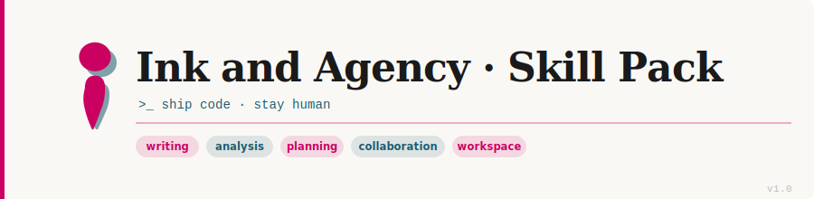
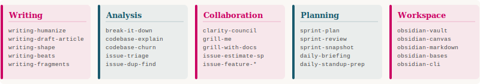

# Ink and Agency Skills Pack

A small, opinionated library of Claude-compatible skills.

This repo is meant to be easy to scan, easy to install, and easy to extend. Each folder is a self-contained skill, so you can browse the pack like a catalog instead of reading a giant manual.



## What’s in the pack

- Practical skills for writing, planning, triage, architecture, and workspace workflows
- One `SKILL.md` entry point per skill folder
- Supporting docs where a skill needs examples, formats, or deeper guidance

## Skill Map

| Area | Example skills | What they help with |
| --- | --- | --- |
| Writing | `writing-humanize`, `writing-draft-article`, `writing-shape` | Turning rough text into something clearer and more natural |
| Analysis | `break-it-down`, `codebase-explain`, `issue-triage` | Making sense of code, messages, and bugs faster |
| Collaboration | `clarity-council`, `grill-me`, `grill-with-docs` | Getting sharper decisions through structured discussion |
| Planning | `sprint-plan`, `sprint-review`, `daily-briefing` | Organizing work, progress, and reporting |
| Workspace tools | `obsidian-vault`, `obsidian-markdown`, `obsidian-canvas` | Managing notes, structure, and visual knowledge maps |



## Quick Start

Clone this repository into your Claude skills directory:

```bash
git clone git@github.com:risadams/skills.git "$HOME/.claude/skills"
```

That’s it. Once the repo is in place, Claude can discover the skills directly from the folder structure.

## Check the install

After cloning, you should see paths like these:

- `$HOME/.claude/skills/writing-humanize/SKILL.md`
- `$HOME/.claude/skills/clarity-council/SKILL.md`
- `$HOME/.claude/skills/codebase-explain/SKILL.md`

## Using skills

There is no separate run command.

Skills are triggered in chat by asking for the behavior you want. A few examples:

- Use `writing-humanize` on this paragraph.
- Use `codebase-explain` for this module.
- Triage `PROJ-1234`.
- Run a `clarity-council` on this design.

## Browse the catalog

The full inventory lives in **[CLAUDE.md](CLAUDE.md#skills-inventory)**. That file is the source of truth for the skill list and descriptions, which keeps this README short and prevents drift.

## Release notes

- **v1.0** (2026-05-18) — Initial skill pack

## Contributing notes

This is an unsupported personal project. Fork freely, but no PRs are accepted.

Keep the structure stable so the skills remain easy to discover:

- Keep each skill folder name stable, for example `writing-humanize`, `diagnose`, `clarity-council`
- Keep `SKILL.md` at the root of each skill folder
- Each skill folder should be self-contained, and include its own README and supporting docs
- Keep nested docs inside the skill folder when they add useful examples or reference material
- Avoid adding new top-level folders that aren’t skills, to prevent clutter
