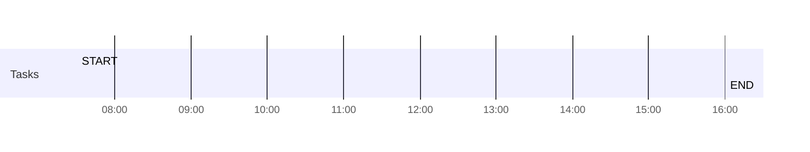

# Daily Briefing Report — Template

Use this exact structure when writing to the daily note. The frontmatter mirrors existing vault conventions (tags, aliases, category). Skip a section only if it would be empty AND noting "nothing here" adds no signal.

Placeholders use `{{double-braces}}` — replace with real content; never write literal `{{...}}` to the file.

## ⛔ MANDATORY sections — never omit, never silently drop

The following sections are **required on every daily note** and are exempt from the "skip if empty" allowance. They have silently disappeared from real runs before (the chart vanished for 4 consecutive June 2026 notes; see [[feedback_daily_note_mandatory_sections]]). If the underlying data is thin, render a minimal/placeholder version — do NOT drop the section:

1. **`#### Day at a glance`** — the Mermaid `gantt`. If the calendar is empty, still render the gantt with just the `START`/`END` anchors and a "Open day — no meetings" note. Never replace it with a plain bullet list.
2. **`#### Email triage at a glance`** — the Mermaid `pie`. If zero emails, render with `"Nothing to triage" : 0` placeholder or a one-line note, but keep the section.
3. **`### 👥 Team Daily Notes`** — the scrum standup wikilink(s). Omit ONLY when `Glob` confirms zero team daily notes exist for the date (the genuine absence case in step 5). If a team note exists, the link is mandatory.
4. **`### 📊 Cross-day context`** — the `![[Daily Notes Dashboard.base#Recent (cards)]]` + `![[TODO#By tag]]` embeds. Always present (they self-render even when sparse).

A plain-bullet `## 🗓️ Today's Schedule` table is a **complement to** the gantt, not a **replacement for** it. Both render.

---

## File header (frontmatter + title)

```markdown
---
tags:
  - daily
  - briefing
aliases:
cssclasses:
category: daily
date: YYYY-MM-DD
---

# ☀️ Daily Briefing — {{Day}}, YYYY-MM-DD

*Generated {{HH:MM}} · Part of [[YYYY-W{NN}]] · [[YYYY-M{MM}]]*


```

---

## Body sections

### Executive Summary

3-5 bullets. The most important things to know in 30 seconds. Examples:

- **2 emails need a reply today** — one from [[@Alex Rivera]] re: {{topic}} (deadline EOD)
- **Heavy meeting day** — 6 meetings, no lunch gap, 1 conflict at 14:00
- **Prep needed** — leadership review at 15:00 has no prep buffer
- **2 free blocks** — 09:00–10:30 and 16:30–18:00

#### Day at a glance

**⛔ MANDATORY — see "MANDATORY sections" above. Render the gantt even on empty days; never substitute a plain bullet list.**

Render today's schedule as a Mermaid gantt so the day's shape is visible at a glance. Use `HH-mm` for `dateFormat` (Mermaid quirk — dashes, not colons) and `%H:%M` for `axisFormat`. Insert one `:HH-mm, {{duration}}mm` task per meeting in the **Tasks** section, and one per free block in the **Breaks** section. The `START` / `END` markers anchor the chart to the working day; adjust the start/end times and the START duration (`{{end_minus_start}}mm`) to match the user's actual workday.

> ⛔ **NEVER put a colon (`:`) inside a gantt task label.** Mermaid splits each task line on the *first* colon to separate the label from the `:HH-mm, NNmm` metadata. A label like `Gap 09:00-10:00 :09-00, 60mm` makes Mermaid try to parse `00-10:00 :09-00` as a date and the whole diagram fails with `Error parsing Mermaid diagram! Invalid date`. This also bites `Lunch gap 12:00-15:00`, `Seals (1:1)`, etc. **Write time ranges in labels with periods or `to`** — `Gap 09.00-10.00`, `Lunch gap 12–3`, `Seals (1-1)` — and keep the only colon on the line in front of the `HH-mm` metadata. Same rule for any colon (ratios, times, `note:`); strip it from the label.



#### Email triage at a glance

**⛔ MANDATORY — see "MANDATORY sections" above. Keep the pie even when email volume is zero (use a placeholder slice).**


**Backfill briefings** (gap > 1 day since last note) — lead with a callout bullet so the catch-up scope is obvious:

- **🔄 Backfill — covers {{N}} days since [[YYYY-MM-DDD]]** ({{Day}}). {{N-1}} non-working days collapsed: {{e.g., "weekend + Friday off"}}.

### 📥 Email — {{window label}}

The window label reflects the actual range:

- **Last 24h** — when `gap_days <= 1` (normal daily run).
- **Since [[YYYY-MM-DDD]] ({{Day}}) — {{N}} days** — when backfilling. Group the email subsections (Action required / FYI / Awaiting reply) by day if the window spans more than 2 days *and* the volume is high enough that day-grouping aids scanning; otherwise keep flat.

#### Action required ({{count}})

| From | Subject | Why it needs you |
| :--- | :--- | :--- |
| [[@Firstname Lastname]] or plain name | ... | direct question / deadline / sole recipient |

#### FYI ({{count}})

One-line summary, group similar items:

- 3 build pipeline notifications (all green)
- Weekly newsletter from {{team}}
- [[@Person]] is OOO {{dates}}; backups: [[@Backup1]], [[@Backup2]]

> _Auto-demoted from Action ({{N}} items): {{subject}} ({{reason}}); {{subject}} ({{reason}})._

#### Awaiting your reply ({{count}})

Emails you sent with no response:

- Re: {{subject}} to [[@Firstname Lastname]] ({{N}} days ago)

### 📅 Calendar Recap — {{window label}}

Brief recap of meetings that happened in the briefing window (yesterday for a normal run; multiple days for a backfill). Use `[[Person]]` links for attendees that have vault notes; plain text otherwise. Surface anything that likely produced action items (1:1s, planning sessions, customer calls).

For backfills spanning multiple days, group meetings by day (`#### Thursday — 2026-05-07`, etc.) so each day's recap stays distinct.

### 🗓️ Today's Schedule

| Time | Meeting | Attendees | Notes |
| :--- | :--- | :--- | :--- |
| 09:00–09:30 | Standup | [[@Alex Rivera]], [[@Sam Patel]], [[@Jordan Chen]] | recurring |
| 10:30–11:00 | 1:1 with [[@Travis Lastname]] | [[@Travis Lastname]] | |

#### Flags

- ⚠️ Conflict: {{meeting A}} overlaps {{meeting B}} at {{time}}
- ⚠️ No lunch gap
- ⚠️ {{high-stakes meeting}} at {{time}} — no prep buffer
- ✅ Cancelled: {{meeting}} (frees {{time range}})

### 👥 Team Daily Notes

**⛔ MANDATORY when a team note exists for the date — see "MANDATORY sections" above. Omit ONLY when `Glob` confirms zero team daily notes for the date.**

One bullet per scrum team that has a daily note for today's date. Use the full-path wikilink with a short display alias, then surface the increment / sprint inline so the active sprint context is visible at a glance. Omit this whole section if no team notes exist for today.

- [[Scrum Teams/{{Team}}/Scrum 📅/{{INC}}/{{Sprint}}/YYYY-MM-DD|{{Team}}]] · {{INC}} / {{Sprint}}

### ✅ Open Action Items

Use `- [ ]` checkboxes — these auto-feed into the global `TODO.md` Dataview query.

**This section is for things the user must *do* — not for state they should *know*.** Before writing any bullet, apply the verb test and addressed-to-user test from SKILL.md § 3a. Informational items (OOO notices, status broadcasts, "FYI" reads) belong in **📝 Notes & Follow-ups**, not here. Phantom carryovers (age ≥ 5 days with no fresh email/Jira/MR signal) must be triaged via the phantom-carryover guard before they render — see SKILL.md.

Split into two subsections:

#### Carrying over (still open)

Items pulled from the prior daily note's Open Action Items section. **Filter rule: include ONLY `- [ ]` lines. Drop every `- [x]` line — those tasks were completed and must not reappear.** If the prior note has no remaining `- [ ]` items, omit this subsection entirely.

- [ ] Reply to [[@Taylor Brooks]] re: monthly shout-outs — by **EOD Fri YYYY-MM-DD**  #email
- [ ] {{open item from yesterday's note, verbatim}}  #tag

#### New / from window

Items newly identified from this briefing window (today's email triage, calendar prep needs, MR/Jira churn). Always `- [ ]` — anything you mark `[x]` in the same write is suspicious; fix the source instead.

**Before adding any bullet here, apply the recently-closed dedup rule** (see SKILL.md): if the same normalized action signature was `- [x]` in any of the last 7 daily notes, either suppress (matches in last 3 days) or prompt-then-decide (matches 4-7 days back). The footer below records any silent suppressions for transparency.

- [ ] Reply to [[@Alex Rivera]] re: {{topic}} — by {{deadline}}  #email
- [ ] Review {{document}} before {{meeting}} #prep
- [ ] Follow up on {{thread}} if no response by {{date}}  #email/followup

> _Recently closed (suppressed today): {{normalized action title}} (closed [[YYYY-MM-DDD]])._  
> _Recently closed (suppressed today): {{another suppressed item}} (closed [[YYYY-MM-DDD]])._

**Visual escalation cap:** never render more than two warning emojis on a single action item (e.g., `⚠️⚠️ OVERDUE (N+ days)`). The escalating `⚠⚠⚠⚠ ... 🚨🚨🚨` wall is forbidden — see the stale-carryover rule in SKILL.md.

### 🎯 Proposed Focus Blocks

| Time | Block | Purpose |
| :--- | :--- | :--- |
| 09:00–10:30 | Deep work | Draft reply to [[@Alex Rivera]], review {{doc}} |
| 16:30–17:15 | Prep | Prep for 17:30 leadership review |

> Calendar blocks proposed above are not yet on the calendar — confirm in chat which to draft.

---

### 📝 Notes & Follow-ups

Plain bullets (no checkbox) for context, status awareness, and items that didn't pass the verb/addressed-to-user test for Open Action Items. This is where OOO notices, status broadcasts, and demoted items land.

- {{Person}} is OOO {{dates}}; backups: {{Backup1}}, {{Backup2}}
- {{High-level narrative thread that informs decisions but has no task}}

#### 💭 Open questions (no external deadline)

For decisions the user wants to make eventually but where no one is waiting on the answer. These are NOT tasks — they're personal-grooming items. Render as plain bullets; do NOT carry as `- [ ]`.

- Decide whether to {{topic}} — no external deadline; revisit when {{trigger}}

---

### 📊 Cross-day context

**⛔ MANDATORY — see "MANDATORY sections" above. Always present; the embeds self-render.**

![[Daily Notes Dashboard.base#Recent (cards)]]

#### Open actions across all days

![[TODO#By tag]]

---

## Linking conventions

> **OFM syntax reference:** for the full grammar of wikilinks, embeds (`![[...]]`), callouts, frontmatter properties, block IDs, and mermaid embedding rules, defer to the `obsidian-markdown` skill. The conventions below are vault-specific overlays on top of that syntax.

- **People** — `[[@Firstname Lastname]]` only when a matching note exists at `🤼 Team/**/@Firstname Lastname.md`. Otherwise plain text. Never guess at a last name — verify the note exists first via `Glob`.
- **Teams** — `[[Quartz]]`, `[[Garnet]]`, `[[Slate]]` when the folder/note exists under `Scrum Teams/`.
- **Tags** — use `#email`, `#prep`, `#meeting`, `#followup`, `#email/followup` (slash-nested), or any tag already common in the vault. Don't invent novel taxonomies.
- **Action items** — always `- [ ]` (not `*` or `-`) so Obsidian's task plugin and the global TODO Dataview pick them up.
- **Dates** — use ISO `YYYY-MM-DD` for any date references so they're queryable.
