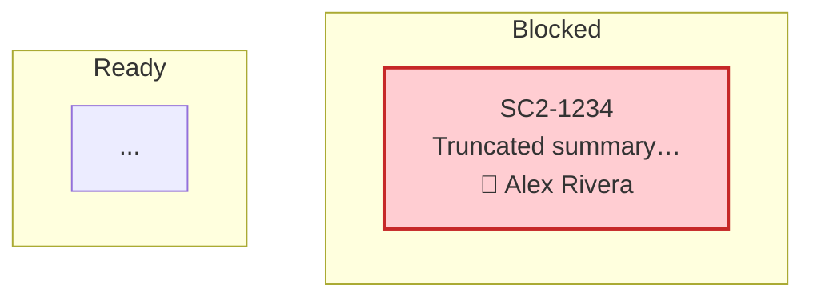

# daily-standup-prep — Reference

Detailed contracts for the algorithms and per-section markdown formatters. The main `SKILL.md` workflow links here for anything that would have made it >200 lines.

## Roster CSV schema

Headerless CSV. The PS `Team-Helpers` module is the source of truth — replicate exactly so a roster file works in both the PS script and this skill.

| Column | Required | Notes |
| :--- | :--- | :--- |
| `FullName` | yes | Exactly two or more space-separated parts. Single-name rows are skipped. |
| `Email` | yes | Used as the highest-priority match key. Trim + lowercase before compare. |
| `Alias` | no | Semicolon-separated list (e.g. `Nick;Nicholas`). First entry becomes `DisplayFirstName`; the full list becomes `Aliases[]` for first-name matching. |
| `Role` | no | Free text. Not used for matching; preserved for downstream tooling. |
| `Flags` | no | Semicolon-separated capacity flags (e.g. `NewTeamMember;PartTime`). Not used by this skill but preserved when reading. |

Skip rules: blank lines, lines starting with `//`. Alias uniqueness is enforced case-insensitively across the roster — reject duplicates with a warning and prefer the first occurrence.

Derived fields (compute on load, do not read from CSV):

```
FirstName        = nameParts[0]
LastName         = nameParts[1..-1].join(' ')
JiraName         = "{LastName}, {FirstName}"
DisplayFirstName = Aliases[0] ?? FirstName
HasActivity      = false           # mutated during Phase 4
Issues / Commits / GitLabActivities / ConfluenceActivities = []   # mutated during Phase 4
```

## Identity matching cascade

Verbatim port of `Find-TeamMemberMatch` from `D:\powershell-scripting\src\modules\Team-Helpers\Team-Helpers.psm1`. Inputs: `(email, displayName, username, roster)`. Returns the **first** matching member, or null. Strategies are tried in order; later strategies are skipped once a match is found.

| # | Strategy | Condition | Notes |
| :- | :--- | :--- | :--- |
| 1 | Email exact | `email.trim().lower() == member.Email.trim().lower()` | Highest-confidence; used by Jira/GitLab/Confluence/Git. |
| 2 | Full name exact | `displayName == member.FullName` | Case-sensitive — matches PS behavior. |
| 3 | Jira name exact | `displayName == member.JiraName` | e.g. `"Rivera, Alex"`. |
| 4 | Structured "Last, First" | `displayName ~= /^([^,]+),\s*([^,\s]+)/` then match `LastName == parsedLast AND (FirstName == parsedFirst OR DisplayFirstName == parsedFirst)` | Handles Jira display variants. |
| 5a | First + last component | Split displayName on whitespace; member's first part `==` displayName's first part AND member's last part `==` displayName's last part | Handles middle initials. |
| 5b | First + last initial | Same as 5a but compare only `lastPart[0]` | Handles "Alex R" → Alex Rivera. |
| 6 | First name / alias | If displayName **does not** contain `, `: match if `FirstName == displayName OR DisplayFirstName == displayName OR displayName ∈ Aliases (case-insensitive)` | Single-token names. |
| 7 | Partial substring | If displayName **does not** contain `, `: `member.FullName LIKE *displayName* OR displayName LIKE *member.FirstName*` | Lowest confidence; last resort before username. |
| 8 | Username pattern | `member.FullName.replace(/\s+/, '.') == username OR member.FullName.replace(/\s+/, '') == username` | GitLab/external usernames. |

If multiple members match a given strategy (rare), pick the first by roster order — same as PS `Where-Object | Select-Object -First 1` behavior.

## Section formatters

Each placeholder in the template produces a markdown string. Joiner is `\n` (LF). Empty input → empty string (template still resolves; the section header in the template stays but the body is blank).

### `{{talking_order}}`

```
- [ ] [[@First Last]] - ✅
- [ ] [[@First Last]] (TeamName) - ✅       ← only when len(Teams) > 1
- [ ] [[@First Last]] - 🧽                  ← inactive members go last
```

Algorithm:

1. Sort roster by `(HasActivity desc, FullName asc)`.
2. Split into `active` (`HasActivity == true`) and `inactive` lists.
3. Randomize each list independently — pull-without-replacement style (port of `Get-NextValue [ref]$arrayList` loop).
4. Render active first (suffix `✅`), then inactive (suffix `🧽`).
5. Wikilink the name: `[[@{FullName-with-each-part-TitleCased}]]`. If no `🤼 Team/**/@First Last.md` exists in the vault, render `**First Last**` (bold plain text) instead — do not invent a wikilink.
6. If `IncludeStandupOrder` is off, return empty string.

### `{{jira_state}}` — Mermaid kanban

Spec — exact reproduction of `Format-JiraKanbanForMermaid`:



Column ordering and status mapping:

| Column | Statuses (case-sensitive) | Fill / stroke |
| :--- | :--- | :--- |
| Blocked | `Blocked` | `#ffcdd2` / `#c62828` |
| Ready | `To Do`, `Open` | `#e8f5e8` / `#2e7d32` |
| In Progress | `In Progress` | `#fff3e0` / `#f57c00` |
| In Review | `In Review`, `Code Review` | `#e3f2fd` / `#1976d2` |
| Done | `Done`, `Closed`, `Resolved` | `#f3e5f5` / `#7b1fa2` |

Per-issue rules:

- Issue node ID = `key.replace('-', '_')` (Mermaid IDs disallow `-`).
- Truncate `summary` to 30 chars + `…` if longer.
- Render assignee row as `👤 First Last` or `👤 Unassigned`.
- Skip a column entirely if zero issues map to it (don't render an empty `subgraph`).
- All styling lines emitted at the bottom in one block — one `classDef` + one `class` per issue.
- Wrap the whole output in a fenced ```mermaid``` block plus a trailing blank line.

If the kanban query returned zero issues, replace the entire block with `_No <Team> items found in current sprint._` (use the team name verbatim, capitalized).

### `{{jira_issues}}`

Per matched issue:

```markdown
### {KEY} - {Summary}

JIRA:{KEY}

**Type:** {Type} | **Status:** {Status} | **Assignee:** {Assignee or "Unassigned"}

**Recent Activity:**

- **(YYYY-MM-DD HH:mm)** - **WHO:** {Author} | **WHAT:** {What} | **WHY:** {Why}
```text
{Details}
```

---
```

`What` / `Why` derivation — match the PS `$activityWhat` / `$activityWhy` fallbacks:

- Comment activity → `What = "Comment"`, `Why = "Team member activity"`, `Details = "Added comment: {body, truncated 200 chars}"`.
- Field-change activity (changelog item) → `What = "{fieldName} change"`, `Why = "Team member activity"`, `Details = "Changed {fieldName} from '{from}' to '{to}'"`. Special-case strings for `status`, `assignee`, `priority`, `resolution`, `Fix Version`, `Sprint`, `labels` use the PS templates verbatim (e.g. `"Changed status from 'In Progress' to 'In Review'"`).

Order activities chronologically descending within each issue. Order issues by their most-recent activity date descending.

### `{{git_updates}}`

Per matched team member with ≥1 commit, sorted alphabetically by `FullName`:

```markdown
### [[@First Last]]

**Git Commits:**

- **(YYYY-MM-DD HH:mm)** `abcdef0` - {Subject line}
```

`abcdef0` = first 7 chars of the commit SHA. Sort the bullet list within each member by date descending. The TeamName suffix `(TeamName)` is appended after the wikilink only when the run includes >1 team.

### `{{gitlab_updates}}`

Render up to three subsections, each only if it has ≥1 entry. Skip the heading entirely when empty (don't render `## Merge Request Activity` followed by nothing).

Empty whole section → `_No GitLab activity found in the specified time period._`.

**Merge Request Activity** (one block per `GitLab MR Created` activity):

```markdown
## Merge Request Activity

### {MR title}

**Type:** GitLab MR Created | **Date:** YYYY-MM-DD HH:mm | **Author:** {Name}

**Link:** [{MR title}]({web_url})

**Status:** {state} (Draft)        ← " (Draft)" only if is_draft
**Branches:** {source} → {target}

---
```

**Comment Activity** (one block per `GitLab MR Comment`):

```markdown
## Comment Activity

### Comment on {MR title}

**Type:** GitLab MR Comment | **Date:** YYYY-MM-DD HH:mm | **Author:** {Name}

**Link:** [{MR title}]({web_url})

**Comment:**
```text
{comment body}
```

---
```

**Pipeline Activity** (one block per `GitLab Pipeline`):

```markdown
## Pipeline Activity

### Pipeline {pipeline_id} - {status}

**Type:** GitLab Pipeline | **Date:** YYYY-MM-DD HH:mm | **Author:** {Name}

**Link:** [Pipeline {pipeline_id}]({web_url})

**Branch/Ref:** {ref}
**Status:** {status}

---
```

Each subsection sorts entries by date descending.

### `{{confluence_updates}}`

Empty → `_No Confluence activity found in the specified time period._`.

Per matched page:

```markdown
### {PageTitle} [{SpaceName}]

**Type:** Confluence Page Update | **Last Modified:** YYYY-MM-DD HH:mm | **Author:** {UpdatedBy}

**Link:** [{PageTitle}]({base_url}/pages/viewpage.action?pageId={page_id})

**Content Preview:**
```text
{snippet}
```

---
```

Snippet algorithm (port of `Get-ConfluenceContentSnippet`):

1. Fetch `body.view.value` from the page.
2. Strip all HTML tags via regex: `s/<[^>]+>/ /g`.
3. Collapse runs of whitespace to a single space; trim.
4. Truncate to 200 chars, append `…` if cut.
5. Omit the `**Content Preview:**` block entirely if the snippet is empty.

Sort pages by last-modified date descending.

## Template placeholder set

Exact set the renderer must replace (matches `ConvertTo-TemplateMarkdown` from the PS script). Any placeholder not in the input data renders as the empty string — never leave a literal `{{…}}` in the output.

| Placeholder | Source |
| :--- | :--- |
| `{{date}}` | `YYYY-MM-DD` Pittsburgh local |
| `{{team}}` | TitleCase team name |
| `{{sprint}}` | `Sprint` arg, integer as string |
| `{{increment}}` | `Inc` arg, integer as string |
| `{{talking_order}}` | Phase 5 — talking_order formatter |
| `{{jira_state}}` | Phase 5 — Mermaid kanban |
| `{{jira_issues}}` | Phase 5 — jira_issues formatter |
| `{{git_updates}}` | Phase 5 — git_updates formatter |
| `{{confluence_updates}}` | Phase 5 — confluence_updates formatter |
| `{{gitlab_updates}}` | Phase 5 — gitlab_updates formatter |

## Output path

```
{{vault_root}}\Scrum Teams\{TeamTitleCase}\Scrum 📅\INC {Inc}\Sprint {Sprint}\YYYY-MM-DD.md
```

The `📅` emoji is preserved literally in the path. `mkdir -p` the full chain. The filename is plain ISO date (no `D` prefix — that's reserved for the personal daily note in `daily-briefing`).
