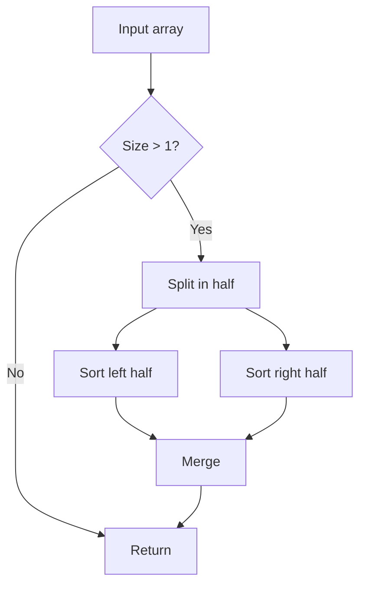

# Obsidian Markdown

Create and edit valid Obsidian Flavored Markdown — the CommonMark + GFM superset that adds wikilinks, embeds, callouts, properties (frontmatter), comments, highlights, math (LaTeX), Mermaid diagrams, and more. The skill covers Obsidian-specific syntax only; it assumes you already know standard markdown.

## Why this exists

Obsidian extends markdown in ways that look small until they don't render correctly. A wikilink with the wrong delimiter, a callout with no blank line before content, a block ID placed inside a list item instead of after it — all of them produce "the file looks broken in Obsidian" without obvious cause. This skill writes Obsidian Flavored Markdown that renders correctly the first time, and edits existing notes without introducing the small syntax mistakes that break the reading view.

## Triggers

Invoke this skill by:

- Saying any of these in chat:
  - "create an Obsidian note"
  - "add a callout to this note"
  - "embed an image in markdown"
  - "use wikilinks for these references"
- Working with any `.md` file inside an Obsidian vault (the skill activates when context indicates an Obsidian environment)

## What it does

The skill writes valid Obsidian Flavored Markdown across all extensions: frontmatter properties (with proper YAML quoting and the recognized fields like `tags`, `aliases`, `cssclasses`), wikilinks (with display text, heading anchors, and block IDs), embeds (`![[...]]` for notes, images, PDFs with page anchors), callouts (with type, custom titles, foldability), comments (`%%hidden%%`), highlights (`==yellow==`), inline tags, math (LaTeX inline and block), Mermaid diagrams (with internal-link classes), and footnotes. It does **not** modify other Obsidian artifacts (`.canvas`, `.base`) — those have dedicated skills.

### Inputs

- **Note content or modification request** — free-form.
- **Optional vault context** — existing notes for wikilink suggestions, existing tag taxonomy.

### Outputs

- A `.md` file with valid Obsidian Flavored Markdown.

### External systems used

- Local filesystem (read/write `.md` files)
- Obsidian (the file renders inside the Obsidian app — the skill itself is filesystem-only)

## How to use it

A typical session looks like this:

```text
You: create a note for the Project Atlas design with frontmatter,
     embed the architecture diagram, link to the related notes, and
     add a "Decisions" callout listing what's been agreed.

Skill: Writing Projects/Atlas Design.md:

       ---
       title: Atlas Design
       date: 2026-05-12
       tags:
         - project
         - design
         - active
       status: in-progress
       ---

       # Atlas Design

       This document captures the architecture decisions for [[Project Atlas]].

       ## Architecture

       ![[phoenix-architecture.png|600]]

       ## Decisions

       > [!important] Key decisions agreed 2026-05-08
       > - Use OAuth instead of basic auth
       > - Single Postgres instance, no sharding for v1
       > - notifications-worker is fire-and-forget (no retry on failure)

       See also: [[OAuth Migration Notes]], [[2026-05-08 Design Meeting]].

       Saved.
```

## Getting the most out of it

- **Use wikilinks for everything inside the vault.** Obsidian tracks renames automatically when you use `[[Note Title]]`. Use markdown links `[text](url)` only for external URLs. Mixing them creates broken links when you rename notes.
- **Set frontmatter properties early.** `tags`, `aliases`, and `status`/`type` properties are how bases query your notes. A note without frontmatter is invisible to most queries.
- **Use callouts for sidebar-style content.** Tips, warnings, decision notes, FAQ blocks all read better as callouts than as nested lists. Foldable callouts (`> [!faq]-`) keep long notes scannable.
- **Use block IDs for stable references.** When you want to link to a specific paragraph that may move, append `^block-id` to the paragraph and link with `[[Note#^block-id]]`. The link survives reorganization.

## Anti-patterns

What this skill will NOT do, or what to avoid:

- ❌ **Mix wikilinks and markdown links for vault notes.** Pick wikilinks. Markdown links to vault notes don't track renames; they break silently.
- ❌ **Forget the blank line after a callout type.** `> [!note]` followed by content on the next line works. Putting content on the same line breaks the callout.
- ❌ **Use literal `\n` in note content.** Markdown uses real newlines, not escapes. The escapes only matter for canvas text nodes (see [obsidian-canvas](../obsidian-canvas/)).
- ❌ **Put block IDs inside list items.** Block IDs go after the list item or quote block (on a separate line), not inside it.

## Examples

### Example: Frontmatter + wikilinks + callouts + tasks

```markdown
---
title: Weekly Review 2026-05-12
date: 2026-05-12
tags:
  - review
  - weekly
aliases:
  - WR 2026-05-12
---

# Weekly Review

## What I shipped

- [x] [[Project Atlas]] design doc
- [x] [[Auth migration spike]]
- [ ] Move on the [[Q3 planning]] questions

## What blocked me

> [!warning] Recurring blocker
> Async standups still don't surface dependency conflicts until the
> following day. See [[Standup retrospective 2026-04-29]] for the
> last time this came up.

## Notes

==Highlight: the OAuth migration is going to need a feature flag== —
the team isn't aligned on the rollout timeline yet.

See also: [[2026-05-05]] (last week's review), [[OAuth Migration Notes]].
```

Highlights, callouts, tasks, frontmatter, and wikilinks all in one note — the standard Obsidian shape.

### Example: Math + Mermaid in a technical note

````markdown
---
title: Algorithm Notes
tags:
  - reference
  - algorithms
---

# Algorithm Notes

## Sorting

The standard merge sort runs in $O(n \log n)$ time and uses $O(n)$
extra space. See [[Time complexity reference]].



The recurrence is:

$$
T(n) = 2T(n/2) + O(n)
$$

which solves to $T(n) = O(n \log n)$ by the master theorem.
````

Mermaid blocks support `class NodeName internal-link;` to link Mermaid nodes to vault notes. Math uses standard LaTeX inline (`$...$`) and block (`$$...$$`) delimiters.

## Internals

The skill covers Obsidian's markdown extensions:

1. **Frontmatter (properties)** — YAML at top with `tags`, `aliases`, `cssclasses`, plus user-defined fields. See [PROPERTIES.md](references/PROPERTIES.md) for property types.
2. **Wikilinks** — `[[Note]]`, `[[Note|display]]`, `[[Note#Heading]]`, `[[Note#^block-id]]`, `[[#Same-note heading]]`.
3. **Embeds** — `![[Note]]`, `![[image.png|300]]`, `![[doc.pdf#page=3]]`. See [EMBEDS.md](references/EMBEDS.md).
4. **Callouts** — `> [!type]`, custom titles, foldable (`-` collapsed, `+` expanded), nested. See [CALLOUTS.md](references/CALLOUTS.md).
5. **Tags** — `#inline`, `#nested/tag`, also in frontmatter `tags:` array.
6. **Comments** — `%%hidden%%` inline, `%% ... %%` block.
7. **Highlights** — `==text==`.
8. **Math** — `$inline$`, `$$block$$` (LaTeX).
9. **Mermaid** — fenced code block with language `mermaid`; `class NodeName internal-link;` for vault-linked nodes.
10. **Footnotes** — `[^1]` with `[^1]: content`, or inline `^[content]`.
11. **Block IDs** — `^block-id` after a paragraph (separate line for lists/quotes).

Key constraints:

- **Wikilinks for vault, markdown links for external.** Don't mix.
- **Blank line before callout content** when content goes on a new line.
- **Block IDs on a separate line** after lists or quote blocks.

## FAQ

**Q: Should I use frontmatter `tags:` or inline `#tags`?**
A: Either works. Frontmatter is cleaner for tags that apply to the whole note; inline tags are better when the tag is specific to a section. Both surface in tag search.

**Q: How do I make a callout collapsible?**
A: Add `-` after the type for collapsed-by-default, `+` for expanded-by-default: `> [!faq]- My FAQ` collapses by default.

**Q: Can I link to a specific PDF page?**
A: Yes — `![[document.pdf#page=3]]` embeds page 3. `[[document.pdf#page=3]]` (without `!`) creates a link that opens to that page.

**Q: How do block IDs work?**
A: A paragraph ending in `^block-id` becomes addressable as `[[Note#^block-id]]`. For lists and quote blocks, put the block ID on its own line *after* the block, not inside it.

**Q: Does Obsidian render all GFM features?**
A: Most: tables, task lists, fenced code, autolinks. Some plugins extend further. The skill assumes vanilla Obsidian unless told otherwise.

## Related skills

- **[obsidian-vault](../obsidian-vault/)** — for organizing notes once they're written (index notes, wikilink discipline, finding untagged references).
- **[obsidian-bases](../obsidian-bases/)** — frontmatter properties this skill writes are what bases query against.
- **[obsidian-canvas](../obsidian-canvas/)** — text nodes inside canvases use Obsidian markdown syntax (with `\n` escaping for JSON).
- **[obsidian-cli](../obsidian-cli/)** — for shell-driven creation/editing when scripting.

## Files

- **[SKILL.md](SKILL.md)** — Skill entry point (full syntax reference)
- **[references/PROPERTIES.md](references/PROPERTIES.md)** — All frontmatter property types and tag rules
- **[references/EMBEDS.md](references/EMBEDS.md)** — Audio, video, search, and external embeds
- **[references/CALLOUTS.md](references/CALLOUTS.md)** — Full callout type list, aliases, nesting, custom CSS
